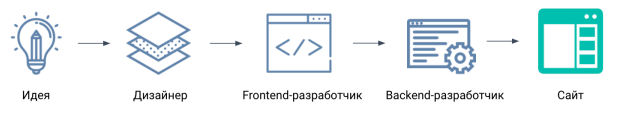

# web-start

### Процесс разработки сайта

### Элементы форм

В HTML существует три основных тега элементов форм:

1. Тег <input> в зависимости от значения атрибута type будет выглядеть по-разному и иметь различные значения. Тег <input> одиночный.

2. <textarea> используется, чтобы сформировать многострочное поле ввода для информации. С помощью атрибута cols можно задать ширину этого поля, а с помощью атрибута rows — указать число строк. Тег <textarea> парный.

3. <select> представляет собой выпадающий список, элементы которого указываются в теге <option>. У этого тега есть несколько атрибутов. Чтобы сделать возможность выбора нескольких пунктов, нужно задать атрибут multiple, в значении которого указывается multiple. В атрибуте size определяется число строк выпадающего списка. Их увидит пользователь в браузере. Если необходимо, чтобы какой-то из элементов выпадающего списка был выбран, нужно этому элементу в теге <option> задать атрибут selected. Тег <select> также парный.

### Использование форматов изображения

- Для сохранения фотографий с чёткими краями лучше всего подходит формат JPEG, так как в нём размер файла получается небольшим. 

- Для анимированных изображений единственный вариант — формат GIF.

- А для сохранения качественных изображений, в которых используется прозрачность, лучше всего подойдёт формат PNG-32.

- Векторной графике подходит SVG.

